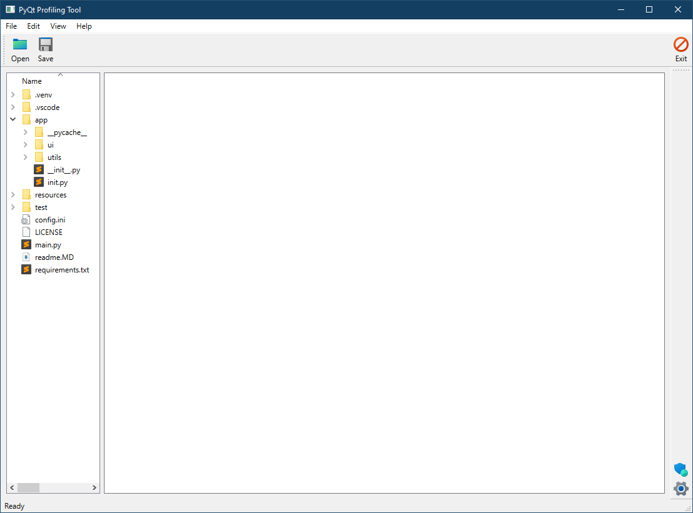
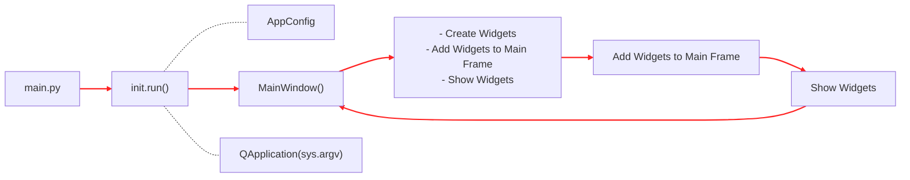

# PyQt Template
This is a template project for PyQt6 GUI applications. It contains a basic skeleton for a modular PyQt6 application that can be extended and customized to create your own PyQt6 application.

## Getting Started
1. Install PyQt6 if you haven't already:
    ```python
    pip install PyQt6
    ```

2. Run the application:
    ```python
    python main.py
    ```
## Files
* **`main.py`**: The main entry point of the application.
  * **`init.py`**: Initializes the QApplication and main window.
    * **`main_window.py`**: Defines the main window with toolbars, tree view, and multiline text field.
    * **`treeview.py`**: Defines the TreeView class, which displays a file system model.
    * **`dialog.py`**: Can be used to create custom dialogs for user interactions.
    * **`menubar.py`**: Defines the menu bar for the main window.
    * **`statusbar.py`**: Defines the status bar for the main window.
    * **`toolbar.py`**: Defines the toolbars for the main window.
    * **`treeview.py`**: Defines the tree view for the main window.

## Modularity
This template project is designed to be modular and extensible. You can easily add new functionality to the application by adding new modules to the **`ui`** or **`utils`** directories. To add a new widget to the main window, you can create a new module in the **`app/ui/widgets`** directory and add the necessary code to create the widget in that module. You can then import and use the new widget in the **`MainWindow`** class in **`app/**ui/main_window.py`**. Similarly, to add a new action to the toolbar or menu bar, you can create a new module in the **`app/**ui/actions`** directory and add the necessary code to create the action in that module. You can then import and use the new action in the **`ToolBar`** or **`MenuBar`** classes.

## Customization
This template provides a basic structure, but you can easily customize it to suit your needs. To add new components or modify existing ones, simply update the relevant Python files in the app directory. For example, you can add new widgets to the app/ui/widgets directory or modify the main window in app/ui/main_window.py.

### How the Main Window is Constructed
The **`MainWindow`** class in **`app/ui/main_window.py`** is the main window of the application. It inherits from **`QMainWindow`** and contains a **`TreeView`** on the left side and a **`QTextEdit`** on the right side. The **`initUI`** method initializes the user interface of the main window by setting the window title, geometry, and central widget.
```python
def initUI(self) -> None:
    """
    Initialize the user interface.
    """
    # Window-Settings
    (...)

    # Create Widgets
    self.create(...)

    # Add Widgets to Window
    self.setMenuBar
    self.setStatusBar
    self.addToolBar
    (...)
```
The Widget-Classes in **`app/ui/widgets`** are called by the **`create_*`** Method of the **`MainWindow`** Class.
```python
def create_treeview(self):
    '''
    Directory-Treeview [PyQt6.QtWidgets.QTreeView]
    '''
    self.treeview = TreeView(self)

def create_edit(self):
    '''
    MutliLine-Editbox [PyQt6.QtWidgets.QTextEdit]
    '''
    self.editbox = QTextEdit(self)

def create_toolbars(self):
    '''
    Top Toolbar [PyQt6.QtWidgets.QToolBar]
    '''
    self.topbar = ToolBar(self,
                            orientation=Qt.Orientation.Horizontal,
                            style=Qt.ToolButtonStyle.ToolButtonTextUnderIcon,
                            icon_size=(24, 24))

    # Top Toolbar Buttons
    self.topbar.add_button("Open", "resources/assets/icons/windows/imageres-10.ico", self.open_file)
    (...)
    '''
    Right Toolbar [PyQt6.QtWidgets.QToolBar]
    '''
    self.rightbar = ToolBar(self,
                            orientation=Qt.Orientation.Vertical,
                            style=Qt.ToolButtonStyle.ToolButtonIconOnly,
                            icon_size=(24, 24))

    # Right Toolbar Buttons
    self.rightbar.add_button("Privacy", "resources/assets/icons/windows/shell32-167.ico", self.privacy_window)
    (...)

    self.addToolBar(Qt.ToolBarArea.TopToolBarArea, self.topbar)
    self.addToolBar(Qt.ToolBarArea.RightToolBarArea, self.rightbar)
```
### Extending
1. **Add new widgets:** Create new custom widgets by adding Python files to the **`app/ui/widgets`** directory. Import these new widgets in main_window.py and add them to the layout as needed.

2. **Enhance existing widgets:** Modify the functionality of existing widgets in the **`app/ui/widgets`** directory


The main functionality of the application is implemented in **`app/ui/main_window.py`**, which is the main window of the application. This window contains a **`TreeView`** on the left side and a **`QTextEdit`** on the right side. The **`ToolBar`**, **`MenuBar`**, and **`StatusBar`** are implemented in separate modules located in the **`app/ui/widgets`** directory. The **`utils`** directory contains some basic utility modules.


## Contribution
Contributions to this project are welcome. If you encounter a bug or have a feature request, please open an issue on the project's GitHub repository. If you want to contribute to the project, you can fork the repository, create a new branch, make your changes, and submit a pull request.

Please make sure to adhere to the project's coding standards and to include appropriate tests and documentation for your changes.

## License
This project is licensed under the MIT License - see the [LICENSE](./LICENSE) file for details.